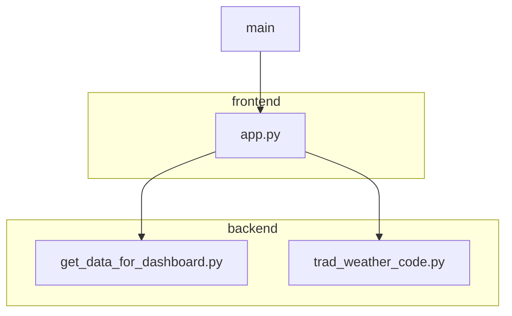

# Dashboard-Python-Meteo

## User Guide

### Description

Cet application contient un histogramme qui représente le nombre de villes sur un température précis et une carte géographique qui représente la température et le météo en temps réel de tous les villes d'un departement.

- Les données de météo viens du site :
https://open-meteo.com/en/docs#api_form

- Les coordonnées géographiques viennent du site: https://geo.api.gouv.fr

### Installation

Pour cloner le projet 

``git clone git@github.com:Ehoky/Dashboard-Python-Meteo.git``

Pour installer l’ensemble des dépendances nécessaires:

``$ python -m pip install -r requirements.tx``

### Démarrage 

Pour lancer cet application:

``$ python main.py``

Et l'application se lance sur l'adresse suivant:

http://127.0.0.1:8050/

### Utilisation
Et l'utilisateur peut choisir le département pour voir la température de tous les villes dans ce département. Il faut cliquer pour voir la température, et le météo peut afficher quand le souris passe dessous d'un cercle.

### Rapport d'analyse

Nous avons utilisé les données dynamiques via API, ce qui nous permet avoir les données de météo en temps réel. 
Cependant, le démarrage et l'update des données prends du temps, on a fait le choix d'affichier le météo d'un département, cela nous permet de ralentir les demandes à l'API météo pour éviter le bug et aussi pour gaganer un peu plus de temps.
On remarque la température dans un département est homogène. 

### Copyright

Je déclare sur l’honneur que le code fourni a été produit par moi/nous-même.

Pour chaque ligne (ou groupe de lignes) empruntée, donner la référence de la source et une explication de la syntaxe utilisée.

Toute ligne non déclarée est réputée être produite par l’auteur (ou les auteurs) du projet. L’absence ou l’omission de déclaration sera considéré comme du plagiat.

## Developper Guide
On a séparé notre programme en frontend(app.py) et backend(get_data_for_dashboard et trad_weather_code.py).
Le fichier main.py appelle le frontend pour lancer tous les contenus de l'application. 
Le backend est appelé par le frontend pour avoir tous les data que le frontend a besoin. 

### Architecture du code

#### Backend

##### 1.get_data_for_dashboard.py

    - get_departments():

        Avec cette fonction, on obtient une dictionaire qui contient une liste de nom de département et une liste de numéro département. 

    - get_cities_coordinates(num_departement):

        En paramètre, l'utilisateur doit mettre le numéro de départment. 
        En sortie, on obtient un type json qui contiens le longitude et latitude de tous les communes de la département.

    - get_weather_for_coor(latitude, longitude):

        En paramètre, l'utilisateur doit mettre les coordonnées géographique(latitude, longitude).
        En sortie, on aura la température et le code de météo. 

    - get_weather(num_departement):

        En paramètre, l'utilisateur doit mettre le numéro de départment. 
        En sortie, on obtient une dictionaire qui contient les listes comme 'nom' de département, le longtitude et le latitude pour ce département, la température et le code pour météo. 

##### 2.trad_weather_code.py

    - decode_weather(weather):

        Cette fonction permet de traduire le code de météo en texte lisible. 
        En paramètre, la fonction prends le dictionnaire de météo.
        Eb sortie, la fonction return une liste de type str qui indique la météo.

#### Frontend 

app.py a deux fonctions:

- get_map(weather):

    Cette fonction permet de tracer les informations météo sur une carte géographique.
    En paramètre, la fonction prends le dictionnaire de météo.
    En sortie, la fonction return un type srcDoc pour le map.

- get_histogram(weather):

    Cette fonction permet de créer une histogramme qui représente le nombre de ville pour chaque température. 
    En paramètre, la fonction prends le dictionnaire de météo.
    En sortie, on obtient une figure de histogramme.

- app.layout:

    Ici, on a tous les component de notre dashboard.

- app.callback:

    Ici, on actualise les données si l'utilisateur a changé le numéro de département. 

