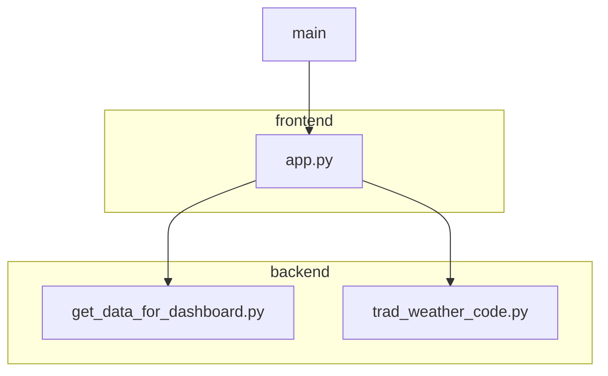
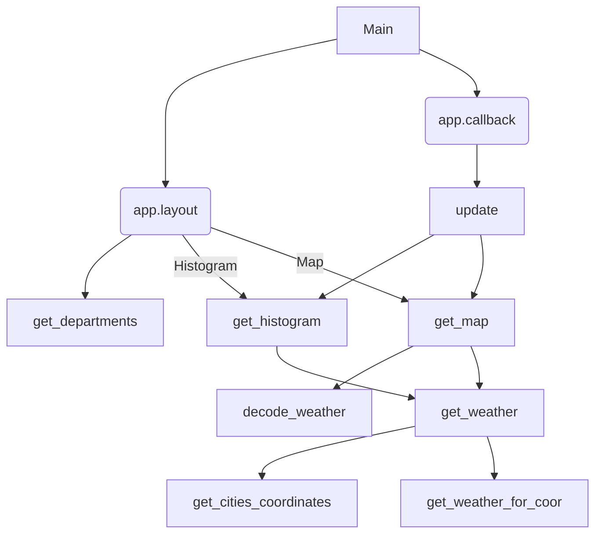

# Dashboard-Python-Meteo

## User Guide

### Description

Cet application contient un histogramme qui représente le nombre de villes en fonction de la température et une carte
géographique qui représente les température et météo en temps réel de toutes les villes d'un departement.

- Les données météo proviennent du site :
  https://open-meteo.com/en/docs#api_form

- Les coordonnées géographiques proviennent du site: https://geo.api.gouv.fr

### Installation

Pour cloner le projet

``$ git clone https://github.com/Ehoky/Dashboard-Python-Meteo.git``

Pour installer l’ensemble des dépendances nécessaires:

``$ python -m pip install -r requirements.txt``

### Démarrage

Pour lancer cette application:

``$ python main.py``

Et le dashboard se lance sur l'adresse suivante:

http://127.0.0.1:8050/

**Notice** : Dû à la quantité de données à traiter, le lancement du programme et le chargement du dashboard sont longs.
Notamment lors du changement de département.

### Utilisation

L'utilisateur peut choisir le département pour voir la température de toutes les communes de ce département.
Sur la carte, la météo s'affiche en survol souris mais il faut cliquer sur la commune pour voir la température.

### Rapport d'analyse

Nous avons utilisé des données dynamiques via 2 APIs, ce qui nous permet d'avoir les données météo en temps réel.

Cependant, le démarrage et l'update des données prennent du temps.
On a donc fait le choix d'afficher le météo d'un
département.
Cela nous permet de ralentir les demandes à l'API météo pour éviter des bugs sans que le temps de chargement soit trop grand.

On remarque que la température dans un département est généralement homogène.

### Copyright

Je déclare sur l’honneur que le code fourni a été produit par nous-même.

## Developper Guide

On a séparé notre programme en frontend (app.py) et backend(get_data_for_dashboard et trad_weather_code.py).
Le fichier main.py appelle le frontend pour lancer tous les contenus de l'application.
Le backend est appelé par le frontend pour avoir tous les data dont il a besoin pour fonctionner.

### Architecture du code

#### Fichiers

#### Fonctions

#### Backend

##### 1.get_data_for_dashboard.py

    - get_departments():
        Cette fonction renvoie un dictionnaire qui contient le nom des départements et leurs numéros associés. 

    - get_cities_coordinates(num_departement):
        En paramètre, la fonction prend le numéro de départment. 
        En sortie, on obtient un objet qui contient les coordonnées longitude et latitude de toutes les communes du département.

    - get_weather_for_coor(latitude, longitude):
        En paramètre, la fonction prend les coordonnées géographique.
        En sortie, on aura la température et le code météo correspondant aux coordonnées. 

    - get_weather(num_departement):
        En paramètre, la fonction prend le numéro de départment (permet d'appeler get_cities_coordinates).
        En sortie, on obtient un dictionnaire qui contient les données géographiques et météorologiques des communes du département. 

##### 2.trad_weather_code.py

    - decode_weather(weather):

        Cette fonction permet de traduire le code météo en texte lisible. 
        En paramètre, la fonction prend le dictionnaire provenant de 'get_weather'.
        En sortie, la fonction retourne une liste de mots qui indique la météo.

#### Frontend

app.py a deux fonctions:

- get_map(weather):

  Cette fonction permet de tracer les informations météo sur une carte géographique.
  En paramètre, la fonction prend le dictionnaire météo.
  En sortie, la fonction retourne un type srcDoc.

- get_histogram(weather):

  Cette fonction permet de créer un histogramme qui représente le nombre de ville pour chaque température.
  En paramètre, la fonction prend le dictionnaire météo.
  En sortie, on obtient une figure histogramme.

- app.layout:

  Ici, on a tous les composants nécessaires à l'initialisation de notre dashboard.

- app.callback:

  Ici, on actualise les données si l'utilisateur a changé le numéro de département. 

